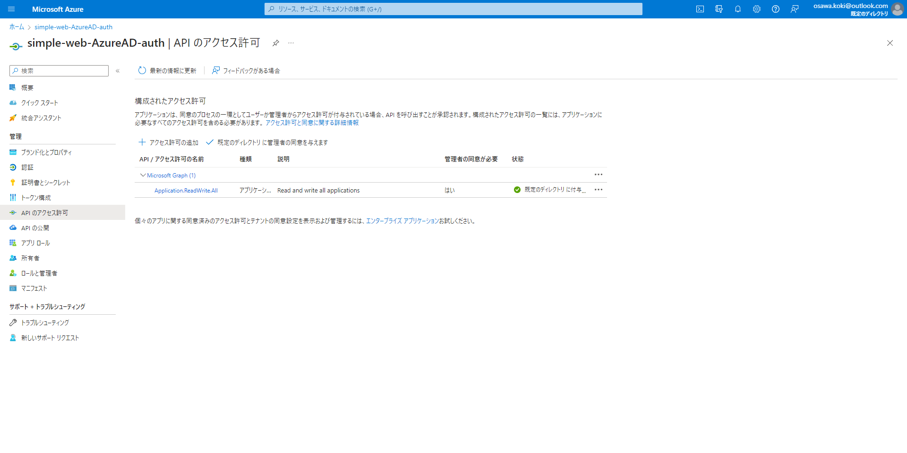

# simple-web-AzureAD-auth

## 準備

以下のGitHubシークレットを設定します。  

| シークレット名 | 説明 |
| --- | --- |
| AZURE_STORAGE_ACCESS_KEY | Azure Storage Accountのアクセスキー (バックエンドサービス) / 事前に作成する必要があります。 |
| STORAGRE_ACOUNT_NAME | Azure Storage Accountのアカウント名 (バックエンドサービス) / 事前に作成する必要があります。 |
| CONTAINER_NAME | Azure Storage Accountのコンテナ名 (バックエンドサービス) / 事前に作成する必要があります。 |
| TFVARS | Terraformの変数ファイル(`terraform.tfvars`)の内容 |
| AZURE_RESOURCE_GROUP | Azure上のリソースグループ名 (`terraform.tfvars`の`project_name`) |
| AZURE_FUNCTIONAPP_NAME | Azure上のFunction App名 (`terraform.tfvars`の`function_app_name`) |
| AZURE_CREDENTIALS | AzureのサービスプリンシパルのJSON |
| ENV_LOCAL | `.env.local`ファイルの中身 |

### Azure CLIのインストール

Azure CLIをインストールします。  
[Install Azure CLI | Microsoft Docs](https://docs.microsoft.com/ja-jp/cli/azure/install-azure-cli)  

以下のコマンドでログインします。  

```shell
az login
```

ログインが完了したら、サービスプリンシパルを作成します。  
[参考](https://github.com/marketplace/actions/azure-cli-action#configure-azure-credentials-as-github-secret)  

```shell
az ad sp create-for-rbac --name "★プリンシパル名★" --role contributor --scopes /subscriptions/★サブスクリプションID★
```

これで出力されたJSONの中から以下の値を取得します。  

| シークレット名 | 説明 |
| --- | --- |
| client_id(appId) | クライアントID |
| client_secret(password) | クライアントシークレット |
| subscription_id | サブスクリプションID |
| tenant_id(tenant) | テナントID |

サブスクリプションIDは以下のコマンドで取得できます。  

```shell
az account show --query id --output tsv
```

これらを`terraform.tfvars`に記載します。  

`terraform.tfvars`のテンプレートは`terraform.tfvars.example`を参照してください。  

---

次に以下のコマンドを実行します。  

```shell
az ad sp create-for-rbac --name "★プリンシパル名★" --role contributor --scopes /subscriptions/★サブスクリプションID★ --sdk-auth
```

`--sdk-auth`をつけることで、`az login`でログインする際に使用するJSONが出力されます。  
これは`Option '--sdk-auth' has been deprecated and will be removed in a future release.`という警告が出ますが、今回はこのまま使用します。  
調べても`--sdk-auth`を使わない方法が見つからなかったので、このまま使用します。  

[参考](https://github.com/Azure/actions-workflow-samples/blob/master/assets/create-secrets-for-GitHub-workflows.md)  

クライアントID・クライアントシークレット・サブスクリプションID・テナントIDもここから取得可能ですが、非推奨ということですので、使用していません。  
二度手間になってしまいますが、、、  

このJSON全体を`AZURE_CREDENTIALS`という名前でGitHubシークレットに設定します。  

---

続いて必要な権限を与えます。  

```shell
az ad app permission add --id {クライアントID} --api 00000003-0000-0000-c000-000000000000 --api-permissions 1bfefb4e-e0b5-418b-a88f-73c46d2cc8e9=Role
az ad app permission grant --id {クライアントID} --api 00000003-0000-0000-c000-000000000000
az ad app permission admin-consent --id {クライアントID}
```

ポータルから`Azure Active Directory`を開き、`アプリの登録`を開きます。  
`★プリンシパル名★`を検索して、クライアントIDをクリックします。  

以下のように`APIのアクセス許可`に`Microsoft Graph (Application.ReadWrite.All)`が追加されていることを確認します。  
また、規定のディレクトリに管理者の同意が与えられていることを確認します。  

  

## 開発環境の構築

### Azure Functionsのローカル実行

`Visual Studio`から実行すればOK!です。  
`local.settings.json.example`を`local.settings.json`にリネームして下さい。  
CORSとMongoDBの接続情報が記載されています。  
特に特殊な環境でなければそのままでOKです。  

### Next.jsのローカル実行

以下のコマンドで実行します。  

```shell
cd ./client
yarn install
yarn dev
```

## 参考文献

- [GitHub Actionsを使用した継続的デリバリー](https://learn.microsoft.com/ja-jp/azure/azure-functions/functions-how-to-github-actions?tabs=dotnet)
- [チュートリアル: 認証コード フローを使用して、ユーザーをサインインさせて React シングルページ アプリ (SPA) から Microsoft Graph API を呼び出す](https://learn.microsoft.com/ja-jp/azure/active-directory/develop/tutorial-v2-react)
